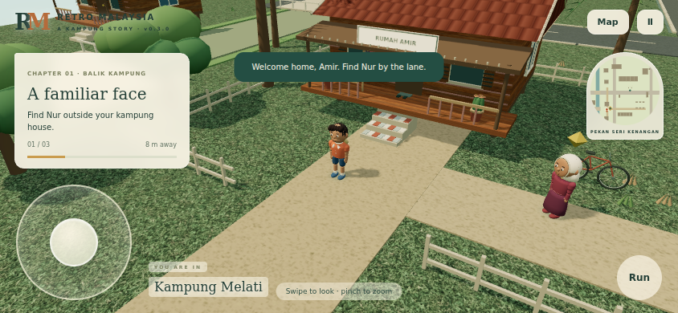

# Retro Malaysia — a kampung story

Playable browser prototype, **v0.3.0**. A fictional Malaysian town around **2001**, mixing kampung lanes and budget terrace homes. Default protagonists **Amir** and **Nur** can be renamed.

## Playable chapter

Leave Amir's timber house → meet Nur → walk through the pekan → talk to Pak Mat at his warung → finish a congkak practice round → return to exploration. Afterward, explore or play a rematch.

The compact town includes Melaka-inspired timber homes, Ipoh-inspired shophouses, an old Sekolah Kebangsaan, a Kuala Kangsar-inspired yellow-domed mosque, terrace homes, a retro bus station and pasar malam stalls. These are original stylized 3D meshes inspired by the agreed references, not exact recreations.

- Landscape-only gameplay, with fullscreen/orientation locking where the browser supports it and a portrait gate otherwise.
- Closer following 3D camera with drag/swipe orbit, vertical tilt, pinch and wheel zoom.
- Original rounded characters with jointed walking/running, clothing, facial detail and a canvas satchel.
- Generated grass/timber materials, tiled roofs, carved eaves, flowers, full shopfronts, detailed warung props and rounded vehicles.
- Feathered palms, fuller tree canopies, afternoon lighting and soft contact shadows. Buildings fade when they hide the player.
- Faster walking at 7.2 world metres/second and running at 11, with obstacle collision and river crossings.
- NPC dialogue, quest progression, destination distance and a zoned town map.
- Larger 144 px phone joystick with a 60 px thumb grip (128 px on very short screens); desktop keyboard support.
- Local progress saves with resume, save validation and graceful storage failure.
- Complete turn-based congkak with relay sowing, capture, extra turns, scoring and a local opponent.
- Static world geometry batched by material and spatial cell; pixel ratio capped at 2 for mobile performance. The world renderer pauses behind modal menus and congkak.
- Optional original synthesized breeze, bird calls, footsteps and shell sounds.
- No server, sign-in, API keys or runtime CDN needed.

## Controls

| Action | Desktop | Phone |
|---|---|---|
| Move | WASD / arrows | Drag joystick |
| Run | Hold Shift | Hold Run while moving |
| Talk | E | Talk button when close |
| Rotate / tilt camera | Drag on the world (Q / R also rotate) | Swipe on the world |
| Zoom | Mouse wheel / pause settings | Pinch / pause settings |
| Map | M / Map button | Map button |
| Pause / close menu | Escape / pause button | Pause / close buttons |

## Run locally

Requires Node.js 22 or newer.

```sh
npm ci
npm run dev
```

Open `http://localhost:4173`. For another device on the same network, use the computer's LAN address and port 4173.

```sh
npm test
npm run build
```

`dist/` contains the complete static game with local Three.js modules. Serve it using `node scripts/dev.mjs --dist`, or deploy that folder to a static host. Opening `index.html` directly through `file://` does not support the module imports.

GitHub Actions runs tests and builds a downloadable `retro-malaysia-playable` artifact. The repository also contains the pinned browser runtime in `vendor/` and `.nojekyll`, so GitHub Pages can serve `main` directly without an npm build. The manual Pages workflow can alternatively publish `dist/` when Pages is configured to use GitHub Actions.

Playing in portrait pauses movement and congkak animation behind a rotate prompt. The initial camera distance is 14 world units, adjustable from 12 to 28; the previous initial distance was 27.

## Congkak practice rules

Seven small houses per side, seven shells per house, and one store per player. Sow counterclockwise into both rows and your own store, skipping the opposing store. Relay when the final shell lands in a populated small house. An empty own house captures the opposite house if populated. A store finish grants another turn. An empty row ends the round and the remaining shells are swept into their owner's store.

This is an explicitly **turn-based introductory variant**. Congkak has regional variations and simultaneous-start forms; this prototype does not claim to implement every traditional rule set. Pak Mat uses a one-move local heuristic.

See [the final prototype design brief](docs/FINAL-DESIGN.md) for the implemented visual direction and scope.

## Scope and next work

Version 0.3.0 implements the current prototype's warm stylized design through original procedural meshes, generated surface textures, articulated animation and local synthesized sound. The first chapter and congkak are playable. Building interiors, other traditional games and later chapters remain outside this prototype. Browser emulation validates the controls; physical phone GPU performance still needs device testing.

Save data is stored in the browser on this device and origin; it does not sync across devices. Only completed chapter progress is saved, not a partly played congkak round. Leaving an unfinished round starts a fresh practice round on return.

## Code layout

- `src/world.js`: authored procedural town, spatial batches, obstacle geometry and camera occlusion.
- `src/characters.js`: original character meshes, jointed animation and per-joint batching.
- `src/movement.js`: analog input and small collision steps independent of frame rate.
- `src/soundscape.js`: original local ambience and foley.
- `assets/`: generated game materials and provenance.
- `src/main.js`: camera, input, quest/dialogue flow, map and minigame presentation.
- `src/congkak.js`: pure board rules and opponent, independent of rendering.
- `src/save.js`: versioned local save validation and storage.
- `tests/`: congkak invariants, complete simulated games and storage failure handling.
- `scripts/`: dependency-free development server and static build.
- `vendor/`: checked-in Three.js browser runtime and its MIT license, required for direct branch publishing.
- `src/boot.js`: startup loader with recoverable module-load errors and a timeout.

## Preview


