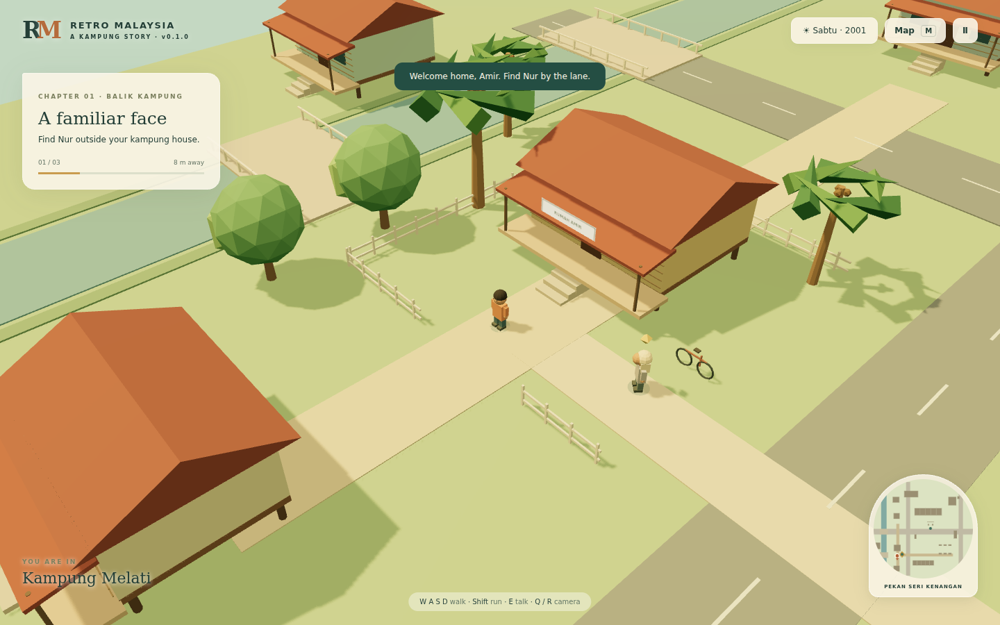

# Retro Malaysia — a kampung story

First playable browser prototype, **v0.1.0**. A fictional Malaysian town around **2001**, mixing kampung lanes and budget terrace homes. Default protagonists **Amir** and **Nur** can be renamed.

## Playable chapter

Leave Amir's timber house → meet Nur → walk through the pekan → talk to Pak Mat at his warung → finish a congkak practice round → return to exploration. Afterward, explore or play a rematch.

The compact town includes Melaka-inspired timber homes, Ipoh-inspired shophouses, an old Sekolah Kebangsaan, a Kuala Kangsar-inspired yellow-domed mosque, terrace homes, a retro bus station and pasar malam stalls. These are original, simplified geometry inspired by the agreed references, not exact recreations.

- Elevated, following 3D camera with rotation and zoom.
- Walking, running, obstacle collision and river crossings.
- NPC dialogue, quest progression, destination distance and a zoned town map.
- Phone joystick and action buttons; desktop keyboard support.
- Local progress saves with resume, save validation and graceful storage failure.
- Complete turn-based congkak with relay sowing, capture, extra turns, scoring and a local opponent.
- Static world geometry batched by material; lower resolution graphics on touch devices. The world renderer pauses behind modal menus and congkak.
- No server, sign-in, API keys or runtime CDN needed.

## Controls

| Action | Desktop | Phone |
|---|---|---|
| Move | WASD / arrows | Drag joystick |
| Run | Hold Shift | Hold Run while moving |
| Talk | E | Talk button when close |
| Rotate camera | Q / R | Curved arrow buttons |
| Zoom | Mouse wheel / pause settings | Pause settings |
| Map | M / Map button | Map button |
| Pause / close menu | Escape / pause button | Pause / close buttons |

## Run locally

Requires Node.js 22 or newer.

```sh
npm ci
npm run dev
```

Open `http://localhost:4173`. For another device on the same network, use the computer's LAN address and port 4173.

```sh
npm test
npm run build
```

`dist/` contains the complete static game with local Three.js modules. Serve it using `node scripts/dev.mjs --dist`, or deploy that folder to a static host. Opening `index.html` directly through `file://` does not support the module imports.

GitHub Actions runs tests and builds a downloadable `retro-malaysia-playable` artifact. A manual Pages deployment workflow is included for use after the changes are merged and GitHub Pages is configured to use GitHub Actions.

## Congkak practice rules

Seven small houses per side, seven shells per house, and one store per player. Sow counterclockwise into both rows and your own store, skipping the opposing store. Relay when the final shell lands in a populated small house. An empty own house captures the opposite house if populated. A store finish grants another turn. An empty row ends the round and the remaining shells are swept into their owner's store.

This is an explicitly **turn-based introductory variant**. Congkak has regional variations and simultaneous-start forms; this prototype does not claim to implement every traditional rule set. Pak Mat uses a one-move local heuristic.

## Scope and next work

This is a functional greybox with a warm low-poly treatment, not the final character or environment artwork. The first chapter and congkak are playable; building interiors, the other traditional games, later quests, full sound design and production character animation are not implemented. Ambience is an optional, locally synthesized placeholder.

Save data is stored in the browser on this device and origin; it does not sync across devices. Only completed chapter progress is saved, not a partly played congkak round. Leaving an unfinished round starts a fresh practice round on return.

## Code layout

- `src/world.js`: procedural scene, town zoning and obstacle geometry.
- `src/main.js`: camera, input, quest/dialogue flow, map and minigame presentation.
- `src/congkak.js`: pure board rules and opponent, independent of rendering.
- `src/save.js`: versioned local save validation and storage.
- `tests/`: congkak invariants, complete simulated games and storage failure handling.
- `scripts/`: dependency-free development server and static build.

## Preview


