# Retro Malaysia — a kampung story

Playable browser game, **v2.1.2**. A fictional Malaysian town, Pekan Seri Kenangan, around **2001**, mixing kampung lanes and budget terrace homes. Play as **Amir** or **Nur** (either can be renamed), earn Duit Poket running deliveries for 14 townsfolk, and save for the toys of the time.

## Chapter 01 · Cuti Sekolah

The first afternoon of the school holidays, the same for both characters. Amir starts outside Rumah Amir in the kampung, Nur outside Rumah Nur in the taman.

1. **Kawan lama**: meet Faiz and Mei Ling at the padang by the gelanggang.
2. **Kerja pertama**: ask Pak Rahman at Kedai Runcit 99 for delivery work and take his parcel for Nenek.
3. **Hantar ke rumah Nenek**: carry the two bags of gula to Nenek at Rumah Tok. Upah RM 1.00.
4. **Teh untuk Nenek**: buy her tea at Pak Rahman's with your own money. She repays the RM 0.70 and the upah.
5. **Congkak di beranda**: play a round of congkak with Nenek on her veranda.
6. **Simpan sikit-sikit**: spend a little of your upah on your first collectible at Uncle Lim's.

Afterwards the town is open: take delivery work from any shop or house, save up, play congkak with Nenek again and visit your friends. A gold diamond points at the chapter's next person, and boxes mark your job stops.

## The town's people

| # | Who | Where | Look |
|---|---|---|---|
| 01 | Pak Rahman, grocer | Kedai Runcit 99 | Gingham shirt, pencil behind his ear, sandals |
| 02 | Pak Din, petrol kiosk | Kiosk Petrol Retro | Faded blue work shirt, red cap, Good Morning towel |
| 03 | Uncle Lim, stationery and toys | Alat Tulis & Game | Polo tucked in, glasses, belt pouch |
| 04 | Makcik Ros, school canteen | Kantin Sekolah | Blouse, apron, tudung |
| 05 | Cikgu Farid, teacher | SK Seri Kenangan | White shirt and tie, folder |
| 06 | Pak Man, mechanic | Bengkel & Tayar | Overalls, rolled sleeves, red rag in his pocket |
| 07 | Kak Ita, food stall | Warung Kak Ita | Baju kurung, batik kain, yellow apron, tudung |
| 08 | Pak Salleh, community organiser | Balai Raya | Batik shirt, clipboard |
| 09 | Ustaz Hassan, imam | Masjid Seri Kenangan | Baju Melayu, songkok, short beard |
| 10 | Pak Mat, gardener | Wakaf Kebun | Straw hat, rubber boots, basket of ulam |
| 11 | Nenek, congkak mentor | Rumah Tok | Floral baju kurung, glasses, white tudung |
| 12 | Atuk, toy storyteller | Rumah Atuk, afternoons at the padang | Loose shirt, kain pelikat, cap, wooden toy box |
| 13 | Faiz, your friend | Rumah Faiz, afternoons at the padang | Graphic tee, shorts, selipar, a mini 4WD in hand |
| 14 | Mei Ling, your friend | Rumah Mei Ling, afternoons at the padang | Striped tee, bob, sling bag |

Each of the 14 has their own afternoon loop around their post (v1.2): Kak Ita stirs her pot, walks over to wipe a table and fans herself; Pak Mat bends over his beds; Uncle Lim reads with his arms folded; Faiz waves and stretches. They stop and turn to you when you come close, and wait while you talk. You decide the loops in `src/routines.js`, a plain list per person of steps (`stand`, `do` an action, `walk` to a spot, `face` a way). There are 15 actions: wave, look, stir, wipe, write, read, fan, stretch, hips, fold, talk, bend, scratch, check and nod.

Every other place has a named household contact (Mak Cik Zaitun at Rumah Amir, Cik Aminah at Rumah Nur, and so on). Shopkeepers offer Buy / Delivery work / Talk; houses and services offer Requests / Talk. Talking once a day, finishing errands and story moments raise friendship from Baru kenal to Kenal, Kawan and Dipercayai.

## Duit Poket and deliveries

Money is in ringgit and sen; you start with RM 2.00.

- **Prepaid parcels**: collect at the sender, hand over at the receiver, get the upah.
- **Purchase requests**: buy the goods at the supplier with your own money; the requester repays the cost plus the upah.
- **Invitation rounds**: one bundle of cards dropped at several houses, paid at the last stop.
- The upah depends on the route, plus 20 sen per extra small item or 40 sen per extra bulky one, and is locked when you accept.
- Up to three jobs at once and 12 spaces in the bag (small goods take 1, bulky ones 3). Cancel a job before collecting, or return bought goods to the shop for a refund. A job is never paid twice.
- Uncle Lim sells guli, pelekat, komik, card packs, gasing, a wau and six Mini 4WD cars. They go into your Koleksi in the bag; the Tamiya is a saving goal.

All **38 locations across five districts** fit the original compact map: 10 kampung, 10 terrace, 8 pekan, 6 community and 4 transport/market. The numbered map includes a district directory. The town includes Melaka-inspired timber homes, Ipoh-inspired shophouses, an old Sekolah Kebangsaan, a Kuala Kangsar-inspired yellow-domed mosque, terrace homes, a retro bus station and pasar malam stalls. These are original stylized 3D meshes inspired by the agreed references, not exact recreations.

- Landscape-only gameplay, with fullscreen/orientation locking where the browser supports it and a portrait gate otherwise.
- Third-person chase camera low behind the shoulder with a wide lens: it swings in behind the runner, pulls in front of walls, frames conversations over the shoulder, and still allows swipe look, pinch and wheel zoom.
- Amir and Nur follow the Jaguh Kampung sheet: heads about a quarter of their height with anime faces, Amir's spiked hair and ringer T-shirt, Nur's hijab under her hoodie hood, baggy cargo trousers, shell-toe sneakers and backpacks. A walk blends into a run with bent-arm pumping and a forward lean. The 14 townsfolk each have their own 3D body, outfit and face from the cast guide: teens in the same style, grown-ups with adult proportions, printed cloth (gingham, batik, florals, pelikat, stripes), tudung, songkok, caps and a straw hat, and the things they carry.
- Generated grass/timber materials, tiled roofs, carved eaves, flowers, full shopfronts and detailed warung props.
- Street props of around 2001 (v1.1): kapcai motorcycles, red and blue plastic warung chairs, LPG tong gas, an ais krim freezer, soft-drink crates, a red pillar post box, Telekom-style payphones, tempayan by kampung stairs, TV aerials on poles, Astro dishes and air-con boxes on the terraces, a kopitiam table, a prepaid-card board, an ais kacang cart, a mosque shoe rack, a gotong-royong banner and a Merdeka ke-44 banner, school warning signs, and timber utility poles with sagging lines. Each building kind places its own props, so they follow the map editor, and trees and paths keep clear of them.
- Landmarks modelled from the concept sheets: a Straits shophouse terrace (salmon five-foot-way pillars over a terracotta-and-cream tiled walkway, arched louvred windows, scalloped valance, weathered plaster, hipped clay roof), a Kuala Kangsar-style mosque (gilded onion dome, four striped minarets with open galleries, cusped red-and-cream arcades) and boxy 1990s family sedans.
- Kampung trees c. 2001, low-poly: leaning kelapa, tattered pisang with jantung, rambutan and mangga in season, jambu air, nangka in its sack, pinang, durian, bamboo, the pekan's rain trees, the school's ketapang and bunga raya hedge, kemboja at the mosque, kebun dapur herbs, and an old beringin by Warung Kak Ita. A dense dusun and rubber smallholding (with tapping cups) rings the town; roads leave through gaps in it. Leaves sway in the breeze. Planting follows the town plan, so it moves with the map editor.
- Thick dark comic outlines, cel-shadow bands, pastel shopfronts, feathered palms and afternoon lighting. Buildings fade when they hide the player.
- A full push on the stick jogs at 4.3 m/s and Run sprints at 6.3 m/s (a light push walks), the speeds the kids' motion-captured jog and sprint cover the ground, with rounded body collisions, wall sliding, gated fences, solid props and bridge-only river crossings.
- Every one of the 38 places has a contact and an interaction point (door, counter or gate) that follows the map editor. The quest card shows the chapter step, the next stop and its distance; the map shows the story diamond and job stops.
- The Beg (bag and Koleksi), the Buku (story, jobs with cancel, totals and Kawan-kawan) and the wallet save with your progress.
- Larger 144 px phone joystick with a 60 px thumb grip (128 px on very short screens); desktop keyboard support.
- Local progress saves with resume, save validation and graceful storage failure.
- Complete turn-based congkak with relay sowing, capture, extra turns, scoring and a local opponent.
- Static world geometry batched by material and spatial cell; pixel ratio capped at 2 for mobile performance. The world renderer pauses behind modal menus, congkak, Dam Haji and gasing.
- Optional original synthesized breeze, bird calls, footsteps and shell sounds.
- The whole town layout comes from one editable plan, with a drag-and-drop map editor and automatic overlap checks. See [the map editor guide](docs/MAP-EDITOR.md).
- No server, sign-in, API keys or runtime CDN needed.

## Moves and the basikal (v2.1)

Amir and Nur can now jump, duck, walk, say hi and ride a bicycle. On a phone, every move button works while your other thumb holds the joystick (v2.1.1).

| Move | Desktop | Phone | What happens |
|---|---|---|---|
| **Lompat** (jump) | Space | Lompat | Motion-captured take-off, airtime and a knee-bend landing; you can jump while running |
| **Cangkung** (duck) | C | Cangkung | Crouch idle and crouch-walk (motion-captured); Run stands you back up |
| **Jalan** (walk) | Z | Jalan | Toggles a brisk walk (1.35 m/s) instead of a jog on a full push |
| **Hai** (say hi) | H | Hai | The right arm waves over whatever the body is doing; townsfolk within 8 m stop, turn and wave back |
| **Basikal** | F | Basikal | Get on or off your bicycle |

**The basikal.** A 2001 kid's bicycle (red for Amir, mint for Nur) waits beside your house, facing open ground. Walk up to it and press Basikal.
- **Riding:** the bike steers toward the stick, speeds up and coasts, turns harder at low speed and leans into corners. Pulling back brakes, and from a stop rolls the bike backwards with the rear wheel turning toward the stick, so it can back away from a wall (v2.1.1). A full push cruises at 6.5 m/s and Run pedals at 8.5 m/s.
- **The rider:** sits on the saddle and leans over the swept-back bar with hands on the grips. The feet follow the pedals as the cranks turn, and stay still when you coast (freewheel).
- **Bell and getting off:** Hai becomes **Loceng** and rings the bell. Talking to someone or pressing Basikal again gets you off. The bike stays where you left it on its kickstand, shows as a red dot on the minimap, and saves with your game.
- **Stuck?** Pause (Ⅱ) → **Reset basikal** parks it beside you, facing open ground. If you push for two seconds without the bike moving, it lifts itself out to open ground (v2.1.2).

## Real movement for Amir and Nur (v2.0)

Amir and Nur now move like real children. Their walk, jog, sprint, standing idle and talking gestures are **motion-captured** clips from Quaternius' [Universal Animation Library](https://quaternius.com/packs/universalanimationlibrary.html) (CC0), played on its 53-bone human skeleton.

- **Bodies that bend.** Each child is one continuous mesh with smooth skin weights, so knees, elbows, hips and shoulders bend instead of hinging like toy blocks. Clothes are painted onto the same surface: Amir's ringer tee, cargo pants with side pockets, shell-toe sneakers and watch; Nur's hoodie, cargo pants with a pink side stripe and sneakers. Backpack straps ride with the shoulders.
- **Real proportions.** A 1.50 m twelve-year-old with a head about 1/6.5 of their height, instead of the old one-quarter chibi head.
- **Their own faces.** The faces, Nur's hijab and hood, and Amir's new soft, layered hair (no more cone spikes) come from the original character designs.
- **No foot sliding.** The game measures how fast each clip's planted foot moves, blends walk → jog → sprint by your actual speed and plays each one at the matching rate. A light push on the stick walks, a full push jogs and Run sprints. In conversations and at counters the kids use the talking idle.
- The skeleton and clips are a 1.1 MB file (`assets/models/kids-mocap.glb`, 14 of the library's clips since v2.1). If it can't load, the kids fall back to the hand-animated bodies.

The 14 townsfolk still use the earlier hand-animated bodies; moving them to the same skeleton is the next step.

## Open storefronts and solat (v1.10)

Twelve commercial places now show **BUKA / TUTUP** boards with their operating hours. The seven shophouses, neighbourhood shop and petrol kiosk use an original illustrated interior atlas while open; shutters cover the openings after closing. The warung, school canteen and workshop also change their service fronts. Graphics and counter availability share the same clock schedule, including resident-run shops. Ordinary shops run 07:00–19:15, petrol 06:30–21:00, and the warung 07:00–22:00. Delivering an existing parcel remains possible at a closed door.

At **Masjid Seri Kenangan**, choose **Solat · 5 waktu (+20 minit)**. The mosque prayer menu stays available when Ustaz Hassan is off duty. Only the current prayer can be started, once per prayer window/day; completion is saved and grants no money or game rewards. Each action advances the game clock by exactly 20 minutes, with a short transition. Shop states, lighting and NPC duty status follow the new time.

| Game prayer | Fixed game window |
|---|---|
| Subuh | 05:45–07:00 |
| Zohor | 13:15–16:45 |
| Asar | 16:45–19:15 |
| Maghrib | 19:15–20:30 |
| Isyak | 20:30–05:45 the next morning |

This is the fictional town timetable. Late Isyak can cross midnight; its completion belongs to the previous evening until Subuh, preventing repeated use after reloading. After a midnight rollover, sleeping at home wakes at 06:00 that same morning. Older saves gain an empty prayer ledger and keep their existing story, money, collectibles, games and jobs.

## Interactive map (v1.9)

Tap **Map** or the mini-map to open a large, north-up map. Drag to pan, pinch or use **+ / −** to zoom, **Aku** to locate yourself, and **Semua** to fit the town. **Lokasi** toggles the location browser so the map can fill the screen. Overview highlights landmarks; zoom reveals individual house/shop numbers. Tap a pin or building, or search by place, person or game (for example Uncle Lim, Faiz or Tamiya). Filters cover shops, homes, games, NPCs and active delivery stops. Quest and work shortcuts use the current save.

Choose **Tunjuk jalan** to return to the town with a destination card, remaining walking distance, a direction arrow and a blue route on the local mini-map. Routes use the game's walkability checks, avoiding buildings, fences, props and the river except at bridges. Guidance replans when needed and follows moving NPC destinations. It ends at a clear interaction spot; close the card to stop guidance. The map pauses the town, supports keyboard zoom/pan and focus trapping, and leaves progress and inventory unchanged. Navigation is session-only.

## Tamiya · Jom Dash! (v1.8)

Talk to **Faiz or Mei Ling at the padang** and choose **Main Tamiya · Jom Dash!**. Choose **Oval Pekan**, **Selekoh Lapan** (raised figure-eight crossover), or **Litar Jaguh** (lane changer, ramps and tight bends); choose your car and **Laju / Seimbang / Stabil** setup. Enter the grid, start the meter, then tap **Lepas!** at the gold centre. After a three-second countdown, all three cars run automatically for three laps. Your car has a gold overhead marker, Faiz orange, Mei Ling pink. Positions, laps, recovery and finish times appear beside the track.

Uncle Lim has a dedicated **Katalog Tamiya · Dash racers** with original comic portraits, speed, grip, stability, overall power, prices and ownership. Buy each car once using Duit Poket; it remains in your collection. The original `tamiya` collectible becomes **Pekan Runner**, keeping its RM12 price and owned copies. Faiz lends the same starter for free if you do not own it; there is no race entry fee. Owned upgrades become available in the car selector.

| Car | Game price | Power / 100 | Speed | Grip | Stability |
|---|---:|---:|---:|---:|---:|
| Pekan Runner | RM12 | 53 | 46 | 54 | 58 |
| Dash-2 Burning Sun | RM18 | 62 | 57 | 60 | 68 |
| Dash-4 Cannonball | RM24 | 68 | 70 | 65 | 70 |
| Dash-3 Shooting Star | RM32 | 76 | 78 | 74 | 77 |
| Dash-5 Dancing Doll | RM40 | 86 | 82 | 87 | 88 |
| Dash-1 Emperor | RM50 | 93 | 94 | 91 | 93 |

The Dash names reference classic [Dash! Yonkuro cars](https://www.tamiya.com/english/tag/taglist.html?genre_item=e_dash), including the original [Cannonball](https://www.tamiya.com/japan/products/18022/index.html) and [Dancing Doll](https://www.tamiya.com/japan/products/18023/index.html). Meshes and portraits are original stylized game art. Prices and ratings are **arcade tuning**, rather than retail prices, manufacturer specifications or canonical rankings. Higher-tier cars are faster with the same tuning, but an expensive aggressive setup can lose to a cheaper stable car.

Speed sets straight pace; grip controls corner pace; stability controls ramp pace. Laju increases speed but lowers grip/stability. Stabil adds grip and braking control at a small speed cost. Too little control at a tight corner or ramp gives a visible exit and timed recovery. Start accuracy changes the launch delay. Outcomes are computed locally from the car, equipped parts, charge, setup, track, contact timing and every pit decision. Jaguh changes lanes once per lap with an elevated outside return; all cars cycle through the three lanes. The lanes use normalized lap progress for equal race distance; this is an arcade race, not a rigid-body Mini 4WD simulator. Both rivals run real parts and charge: Faiz starts aggressive and takes a two-second setup/battery pit, while Mei Ling favours a steady endurance build. Skip to finish preserves the exact result.

Closing saves the car, build, phase, contact timing, elapsed race time and pit history (including an open pit and its selected parts); return to either friend to resume. Portrait orientation, hidden tabs and lost track graphics pause the race. Ending an unfinished race requires confirmation and pays nothing. Space/Enter activate buttons and selects support keyboard navigation; focus remains inside the dialog. Reduced motion removes wheel/recovery animation. The 3D town renderer waits while a reused, small WebGL renderer shows the comic track.

### Garage, parts and live pits

Open **Garage · pasang parts** before entering the grid. Six slots (motor, gear, battery, tyres, rollers, brake) start with free Stock equipment. Only bought parts appear in their slot. Builds save separately per car; borrowed Pekan Runner can use your parts too. Uncle Lim’s Dash catalogue includes the parts below with original portraits, prices, effects and trade-offs. Buy once; equipment is reusable and remains in the collection.

| Slot | Part | Price | Trade-off |
|---|---|---:|---|
| Motor | Torque / Dash | RM9 / RM12 | Steady pull / high speed and charge use |
| Gear | Torque / Sprint | RM5 / RM6.50 | Control / faster straights, less grip |
| Battery | Burst / Endurance | RM7 / RM10 | Initial power / more charge capacity |
| Tyres | Slick / Sponge | RM4.50 / RM5.50 | Low drag / more grip |
| Rollers | Aluminium / Bearing | RM8.50 / RM11 | Control and weight / momentum |
| Brake | Sponge / Heavy | RM4 / RM7.50 | Ramp control / stronger braking and drag |

During a race, **Ambil kereta · pit 2s** removes your car to the visible workbench immediately. Rivals and the race clock continue. Change **Laju / Seimbang / Stabil**, any owned gear/accessory, or a battery pack, then press **Masuk track**. Each removal costs **at least two seconds**; spending longer choosing adds that time too. Recovery and finished cars cannot enter a pit. Skip is disabled while your car is out. The live charge meter and next track section help decide when to stop.

Fast setups, stronger motors and sprint gearing use more charge per metre. Under 35% charge, pace begins to fade; an empty pack still crawls to the finish. All packs start full for a new race. Switching to an unused pack gives fresh charge; returning to an already used pack keeps its remaining charge, including across reloads. Stopped cars use no charge. Gear/tyres/rollers affect corner pace and derail risk; brakes affect ramp control. A costly aggressive build can lose to a cheaper well-tuned one. Changing to Stabil before technical sections can recover a poor start despite pit time.

The distance timeline is deterministic: changing a build preserves the already-run portion, then calculates the remaining race with the new configuration and stored charge. Watching and skipping settle the same final result and one-time rewards.

| One-time milestone | Reward |
|---|---:|
| Finish the first three-lap race | RM0.80 |
| Finish ahead of Faiz | RM1.20 |
| Finish ahead of Mei Ling | RM1.60 |
| Win first place on all three tracks | RM3.00 + Jaguh Tamiya Pekan badge |

The Beg shows owned cars and the badge; Buku lists milestones, wins and the saved race. Rewards and records settle once after reload. Old saves keep items, wallet, jobs, story, clock, Dam Haji and Gasing. RC steering and multiplayer are future work. In-progress v1.7 races finish under their original rules and timing; new races use parts and live pits.

## Gasing · Atuk and Faiz at the padang (v1.6)

Find **Atuk or Faiz at the padang by the gelanggang** during their normal daytime hours, talk, and choose **Main gasing**. Atuk teaches **Belajar**, lends equipment, offers solo **Latihan sendiri**, and hosts **Cabaran Atuk**. Faiz hosts **Lawan Faiz**. Their errands and existing story events still work. A dirt practice circle and a solid wooden box of tops sit in the court corner and follow the map editor.

1. **Lilit tali:** wind a continuous rope from the tip around the wooden body. The visible turns follow the tapered wood, with the back turns hidden behind it.
2. **Power:** hold the Power button, then release near the gold target (78% ideal, 68–88% marked). Maximum power is less effective than a controlled throw.
3. **Lepas:** tap when the moving release marker reaches the centre. Timing is sampled on contact; the throw starts after the tap completes, keeping the return-to-town button from receiving the same tap. The rope unwinds towards the pulling hand as the gasing lands.
4. **Endurance:** both tops rotate, lose speed, wobble and fall. The longer spin wins; within 0.05 seconds is a draw. The lesson demonstration is easier than Faiz, and Atuk is the strongest opponent. Solo practice has no rival.

This is an explicitly **arcade endurance model**, not a tournament physics reference. Power accuracy and release accuracy set angular speed, stability and dirt drag. Angular speed decreases linearly to the stopping threshold; wobble grows as the top slows. Results are deterministic from the throw. Opponents use bounded, round-specific timing profiles rather than a paid AI service. The maximum clean spin is about 26 seconds. The Skip spin animation button advances to the exact same result.

Atuk's loan is available without a purchase. The **gasing already sold by Uncle Lim** automatically becomes your own usable top if it is in your collection, with a different colour and equal performance. Neither top is consumed. Closing saves the phase, timing values and simulation elapsed time; visit either host and choose **Sambung**. Held input resets safely on close, blur, hidden tabs and portrait orientation. Returning from a saved spin continues the same result. Ending an unfinished round requires confirmation and earns no completion or rewards.

| One-time milestone | Reward |
|---|---|
| Finish Atuk’s Belajar lesson | RM 0.20 |
| Finish a steady spin of at least 20 seconds (stability ≥85%) | RM 0.30 |
| Beat Faiz | RM 0.50 |
| Beat Atuk | RM 1.00 + Jaguh Gasing Pekan badge |

The Buku shows milestones, wins, rounds, personal best and the saved-round status. The badge and owned-equipment note appear in the Beg. Completion, records and rewards settle once across reloads. Old saves keep the wallet, collection, jobs, chapter, clock and Dam Haji progress. The clock and 3D renderer pause behind gasing; the illustrated arena uses local Canvas 2D with reduced-motion support. Keyboard players hold/release Space or Enter on Power and activate Lepas at the centre; assistive activation can tap Power to start and tap again to lock.

Striking/knock-out battles, Pak Salleh’s tournament and multiplayer are later work.

## Dam Haji · meja Pak Din (v1.5)

Talk to **Pak Din at Kiosk Petrol Retro** while he is on duty (07:00–21:00), then choose **Main Dam Haji**. His wooden checkerboard, stools and kopi sit beside the kiosk; the table and stools have collisions and move with the town layout. His shop and delivery work are still available.

- **Belajar**: a guided practice match with contextual explanations and a Hint button.
- **Santai**: a friendly opponent looking three complete turns ahead.
- **Jaguh**: a stronger challenge looking up to five complete turns ahead, within a bounded search budget.
- All decisions run locally in a module worker. If workers are unavailable, a one-turn local opponent keeps the game playable. No API calls, server, entry fee or wagering.
- Tap a red piece and a highlighted destination. Captures animate, Haji appears as two stacked pieces, and the same selected piece must continue a capture chain. Board buttons have square/piece labels and support keyboard activation. Reduced motion is respected.
- Closing the board saves the exact match, including a forced capture chain or Pak Din's pending turn. Talk to Pak Din again and choose **Sambung**. The town clock and world rendering pause behind the board. Resigning requires confirmation and counts as a loss; it does not earn the practice milestone.

Pekan uses an explicit **8×8 house-rule variant**, 12 pieces per side, red first. Men move and capture diagonally forward. Captures are compulsory and a chain must be completed; any complete sequence may be chosen, without maximum-capture or Haji priority. Haji moves along open diagonals in both directions and may land on any empty square beyond one captured opponent. Promotion ends the turn. No legal moves is a loss; threefold repetition or 80 consecutive Haji turns without a capture is a draw. These rules are shown at the table; local/regional rules vary.

| One-time milestone | Reward |
|---|---|
| Finish a Belajar match | RM 0.20 |
| Promote your first red Haji | RM 0.30 |
| Beat Pak Din at Santai | RM 0.50 |
| Beat Pak Din at Jaguh | RM 1.00 + Jaguh Dam Pekan badge |

The Buku lists the milestones, record and saved-match status. The Jaguh badge appears in the Beg. Rewards and completed-match counts settle once, including after reloading. Older saves receive empty Dam progress while retaining the wallet, jobs, collection, chapter and clock. Dam Haji is solo in this release.

## Jam kampung · the town clock (v1.4)

Time passes while you explore: one game minute per real second. Menus, conversations, congkak, Dam Haji and Tamiya stop the clock. A new story starts on **Hari 1, Sabtu, 14:00**. The time, weekday and period (Subuh, Pagi, Tengah hari, Petang, Maghrib, Isyak, Malam) show above your location and in the top bar.

- **Light through the day.** A warm dawn, full afternoon sun, a golden hour from 17:00, a purple Maghrib at 19:30 and a moonlit night. The sun crosses from east to west and its shadows follow. After dark the house windows glow and the cengkerik replace the birds.
- **Street lights.** Lamps come on through dusk and are fully lit by night. The roads have 8 sodium lamps on steel poles, each with a warm orange pool. The kampung lanes and paths have 19 timber poles, each with a fluorescent tube under a tin hood and a cool white pool. The lamp nearest you also lights the children as they walk under it. The pools are one instanced draw, with only one real light, so phones stay fast.
- **The town closes.** Most townsfolk are at their posts from 07:00 to 19:15. Kak Ita's warung stays open until 22:00, Pak Din's kiosk until 21:00, Ustaz Hassan stays at the masjid from Subuh to Isyak and Nenek sits on her veranda until 21:30. Off duty, a shop takes parcels at the door but hands nothing out. Faiz, Mei Ling and Atuk leave the padang and answer at their own front doors.
- **Tidur.** From Maghrib (19:30), go to your own front door and choose **Tidur** to sleep through to **06:00 Subuh** the next day. Past midnight the clock waits at 23:59 until you go home.
- Friendship from talking counts once per game day, not once per real day.
- The day and time save with your progress. Saves from v1.3 and earlier wake on Hari 1 at 14:00.

Change the pace, hours and colours in `src/clock.js`: `MINUTES_PER_SECOND`, `HOURS` per NPC and the light keyframes.

## Katalog Kenangan (v1.3)

All 68 items have original comic illustrations: 26 shop goods, five snacks, 24 collectibles and 13 delivery parcels. Art appears at shop counters, in the bag and collection album, on delivery offers and in the quest book. Tap any picture to view it larger with a Malay nostalgia note. Open **Beg → Katalog Kenangan** to browse the complete catalogue, including delivery-only objects, and filter by category. Browsing does not spend Duit Poket; purchases still use the Beli button. Images are bundled locally and require no image API or server. Existing saves keep their item IDs and balances.

Rebuild the checked-in SVG art with `npm run art`. The images live in `assets/items/`, item names/notes in `src/item-art.js`, and shared image UI in `src/item-ui.js`.

## Controls

| Action | Desktop | Phone |
|---|---|---|
| Move | WASD / arrows | Drag joystick |
| Run | Hold Shift | Hold Run while moving |
| Jump / duck / walk / say hi | Space / C / Z / H | Lompat / Cangkung / Jalan / Hai |
| Basikal (get on or off) | F | Basikal |
| Talk | E | Talk button when close |
| Rotate / tilt camera | Drag on the world (Q / R also rotate) | Swipe on the world |
| Zoom | Mouse wheel / pause settings | Pinch / pause settings |
| Map | M / Map button | Map button |
| Pause / close menu | Escape / pause button | Pause / close buttons |

## Run locally

Requires Node.js 22 or newer.

```sh
npm ci
npm run dev
```

Open `http://localhost:4173`. For another device on the same network, use the computer's LAN address and port 4173.

```sh
npm test
npm run build
```

`dist/` contains the complete static game with local Three.js modules. Serve it using `node scripts/dev.mjs --dist`, or deploy that folder to a static host. Opening `index.html` directly through `file://` does not support the module imports.

GitHub Actions runs tests and builds a downloadable `retro-malaysia-playable` artifact. The repository also contains the pinned browser runtime in `vendor/` and `.nojekyll`, so GitHub Pages can serve `main` directly without an npm build. The manual Pages workflow can alternatively publish `dist/` when Pages is configured to use GitHub Actions.

Playing in portrait pauses movement and congkak animation behind a rotate prompt. The chase camera starts 4.4 m behind and about 2 m above the ground with a 58° lens, adjustable from 3 to 12 m. A swipe pauses the automatic follow for a moment.

## Congkak practice rules

Seven small houses per side, seven shells per house, and one store per player. Sow counterclockwise into both rows and your own store, skipping the opposing store. Relay when the final shell lands in a populated small house. An empty own house captures the opposite house if populated. A store finish grants another turn. An empty row ends the round and the remaining shells are swept into their owner's store.

This is an explicitly **turn-based introductory variant**. Congkak has regional variations and simultaneous-start forms; this game does not claim to implement every traditional rule set. Nenek uses a one-move local heuristic. Wins and rounds played are saved.

See [the final prototype design brief](docs/FINAL-DESIGN.md) for the implemented visual direction and scope.

## Scope and next work

Version 1.0.0 makes the town a working place: the 14-person cast from the NPC guide with their own bodies, both children playable, the rewritten Chapter 01, and the Duit Poket delivery economy. The cast guide's later steps are not in this version: full daily schedules (townsfolk walking between home and work), congkak with the neighbours and a tournament, guli, the bedroom shelf, and multiplayer. Building interiors are also outside it. Browser emulation validates the controls; physical phone GPU performance still needs device testing.

Save data is stored in the browser on this device and origin; it does not sync across devices. The character, name, chapter step, game day and time, position, wallet, bag, collection, jobs, friendship, congkak record and Dam Haji progress (including a partly played match), and gasing progress (including a partly played round), and Tamiya progress (including a partly played race) are saved, not a partly played congkak round. Saves from v0.11 and earlier keep the name and Duit Poket and start the new chapter as Amir.

## Code layout

- `src/world.js`: authored procedural town, spatial batches, obstacle geometry and camera occlusion.
- `src/landmarks.js`: low-poly shophouse terrace, mosque and sedan built from the concept sheets.
- `src/routines.js`, `src/actions.js`: each NPC's editable loop and the idle action poses.
- `src/props.js`: the 2001 street props, utility poles and wires, and the painted atlas of their signs.
- `src/actor.js`: Amir and Nur on the motion-capture skeleton: the smoothly weighted body and clothes, their heads, backpacks, and the speed-matched walk/jog/sprint blend.
- `src/bicycle.js`: the basikal model, its pose and the rider's saddle, pedal and grip targets, and the riding step (speed, steering, lean).
- `assets/models/kids-mocap.glb`: the CC0 skeleton and 14 motion-captured clips (Quaternius Universal Animation Library), pruned from the Godot release.
- `src/characters.js`: one look per character (Amir, Nur and the 14 NPCs) built in metres, anime face drawings, printed cloth, rigidly skinned single-draw meshes and joint animation.
- `src/locomotion.js`: leg-length-relative walk/run cycle, two-bone leg IK and contralateral arm swing.
- `src/illustration.js`: cel-light ramp, halftone shading, pixel-width character hulls (skinned) and town ink.
- `src/town-plan.js`: the editable plan: where every building, vehicle, passer-by and road stands and which way it faces.
- `src/town-layout.js`: building kinds (footprints, raised floors, people spots), the 38 numbered places, districts, the fixed river and bridges, and the layout checks.
- `tools/map-editor.src.html`, `scripts/editor.mjs`: the map editor and its build script (`npm run editor` writes `tools/map-editor.html`).
- `src/collision.js`: circle/rectangle contacts, body-aware bounds and bridge-only river crossings.
- `src/movement.js`: analog input and small collision steps independent of frame rate.
- `src/soundscape.js`: original local ambience and foley.
- `assets/`: generated game materials and provenance.
- `src/main.js`: chase camera, input, character choice, counters and dialogue, quest card, bag, quest book, map and minigame presentation.
- `src/clock.js`: the town clock: game time, weekday and period, who is on duty when, sleeping to Subuh and the light keyframes.
- `src/gasing.js`, `src/gasing-progress.js`: pure throw simulation, phase transitions, save validation and one-time milestones.
- `src/gasing-ui.js`, `src/gasing-arena.js`: pointer/keyboard throw controls and the illustrated dirt arena.
- `src/tamiya-cars.js`, `src/tamiya-parts.js`, `src/tamiya-catalogue.js`: six cars, original portraits, arcade ratings and Uncle Lim's garage catalogue.
- `src/tamiya.js`, `src/tamiya-dynamics.js`, `src/tamiya-progress.js`: deterministic three-car races, saved phases and one-time track milestones.
- `src/tamiya-ui.js`, `src/tamiya-view.js`: accessible race controls and the low-poly 3D circuits.
- `src/dam-haji.js`, `src/dam-progress.js`: pure Dam Haji rules, bounded opponent search, save validation and one-time milestones.
- `src/dam-ui.js`, `src/dam-worker.js`: board presentation, match lifecycle and background opponent.
- `src/congkak.js`: pure board rules and opponent, independent of rendering.
- `src/cast.js`: the 14 NPCs (ids, homes, posts, menus, lines), every household contact and where each person stands.
- `src/story.js`: Chapter 01 for both playable characters: steps, events and the chapter's own jobs.
- `src/economy.js`: items, shops, requests, parcels, upah, jobs, bag space, purchases and friendship, as pure functions in sen.
- `src/save.js`: versioned local save validation (v3, with the optional clock) and upgrades from older saves.
- `tests/`: congkak invariants, complete simulated games, gait and IK reachability, collisions, the economy and chapter rules, and save upgrades and storage failure handling.
- `scripts/`: dependency-free development server and static build.
- `vendor/`: checked-in Three.js browser runtime and its MIT license, required for direct branch publishing.
- `src/boot.js`: startup loader with recoverable module-load errors and a timeout.

## Preview

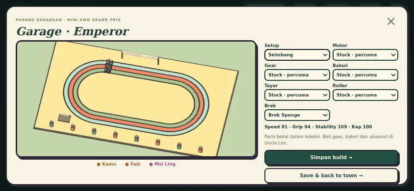

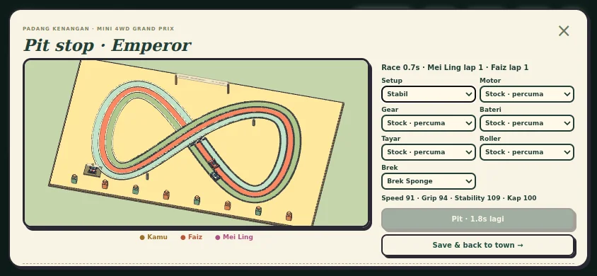

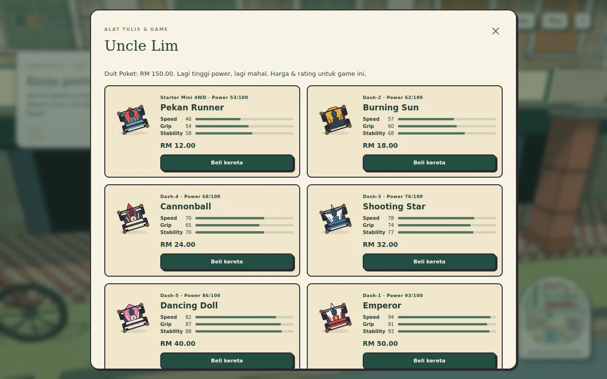

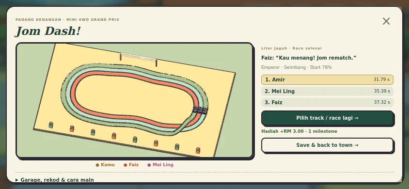

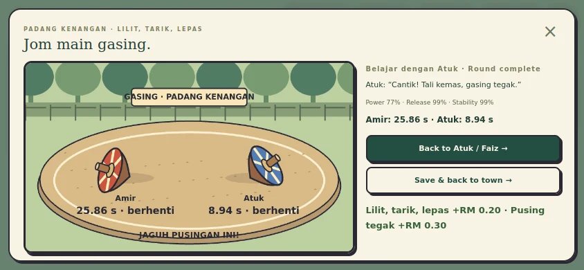

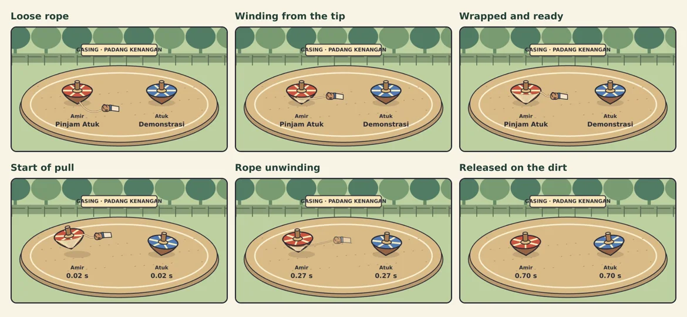

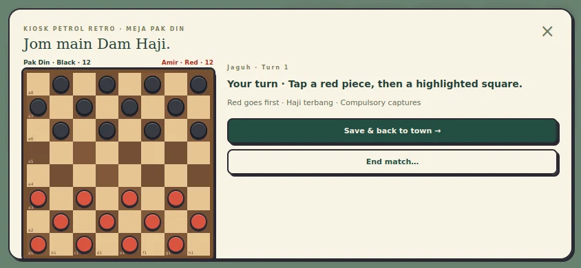

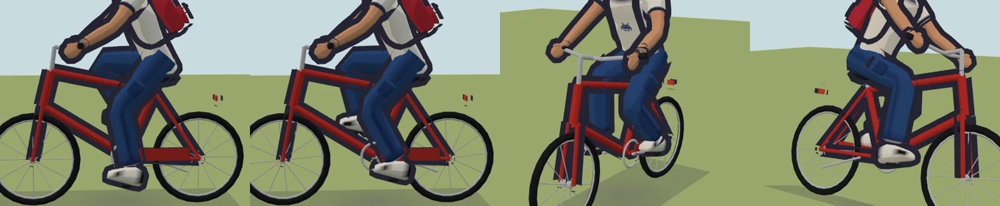

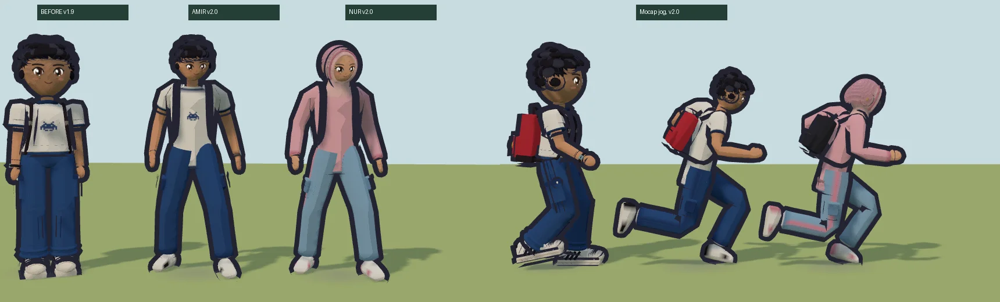

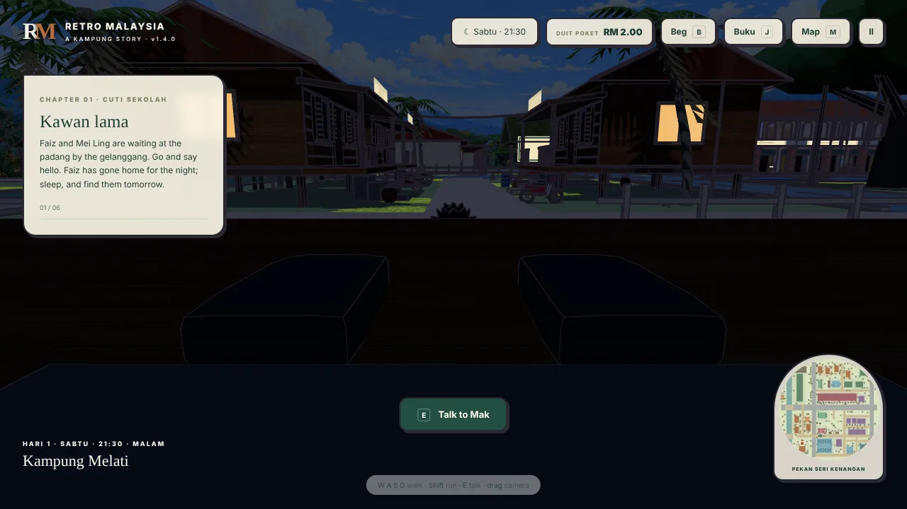

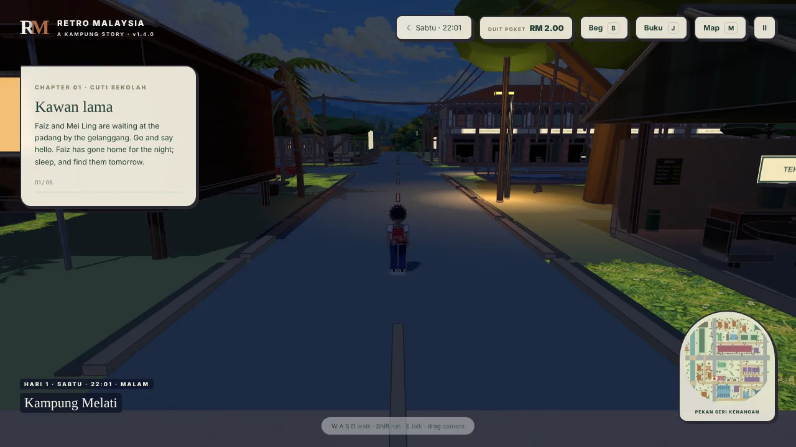

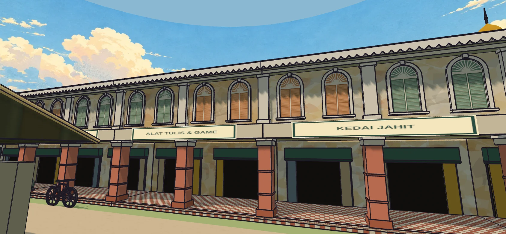

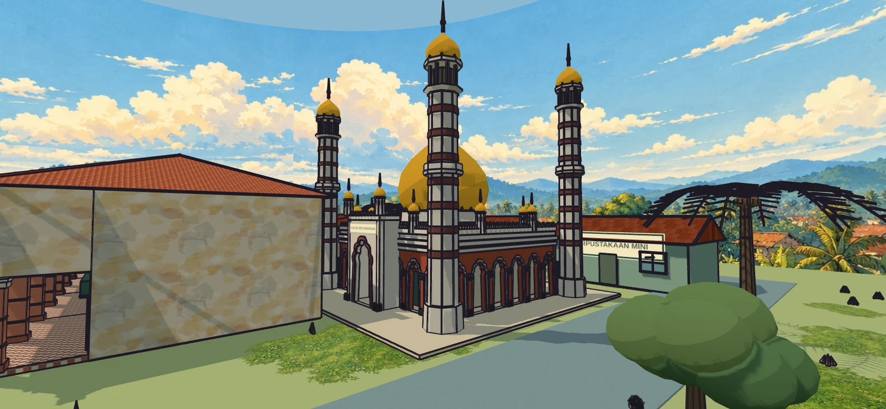

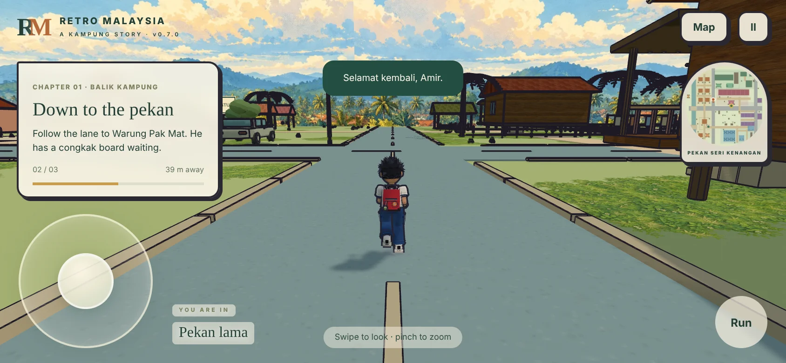

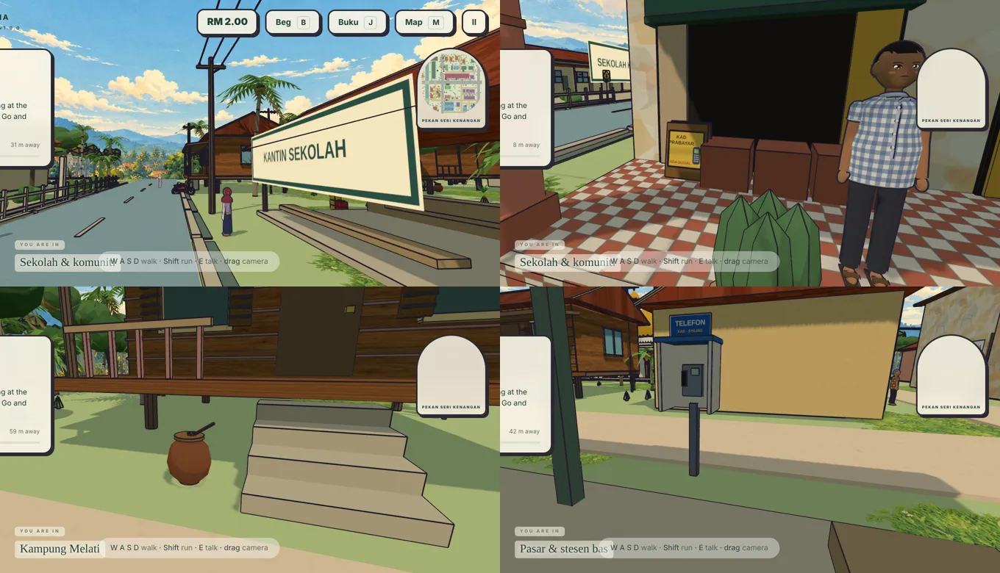

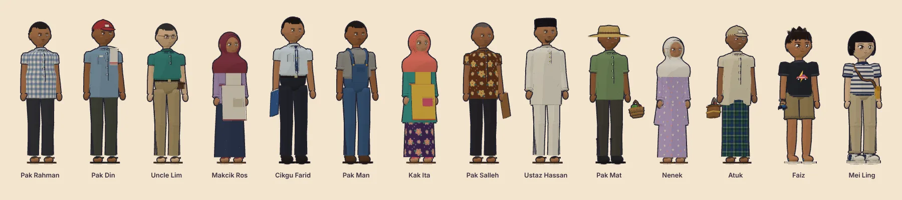

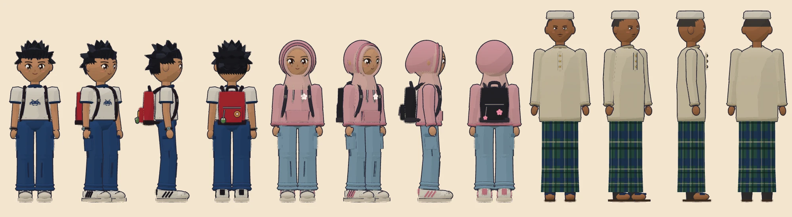

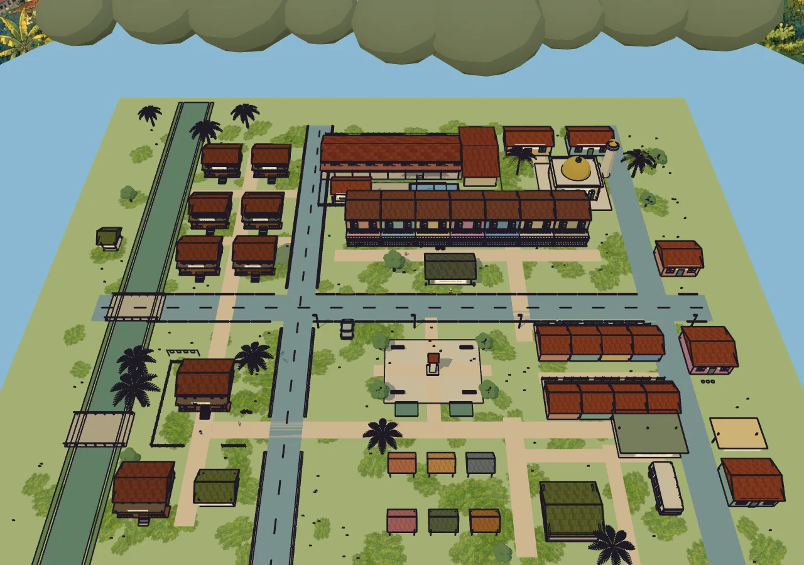

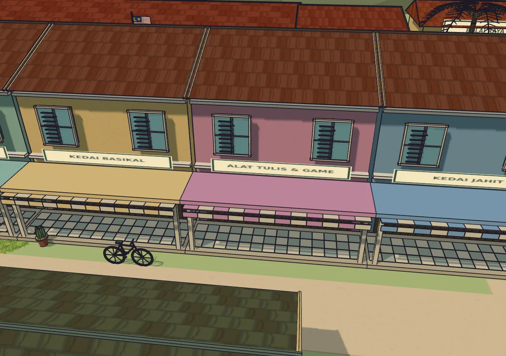

The overhead review camera postpones distant fog to show the entire layout. Gameplay keeps its normal fog and the chase camera. All screenshots are renders of the actual game modules.
