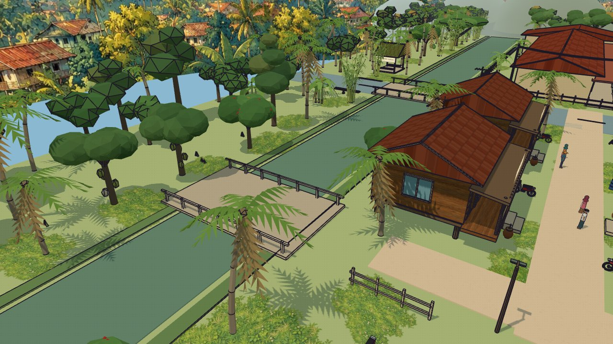
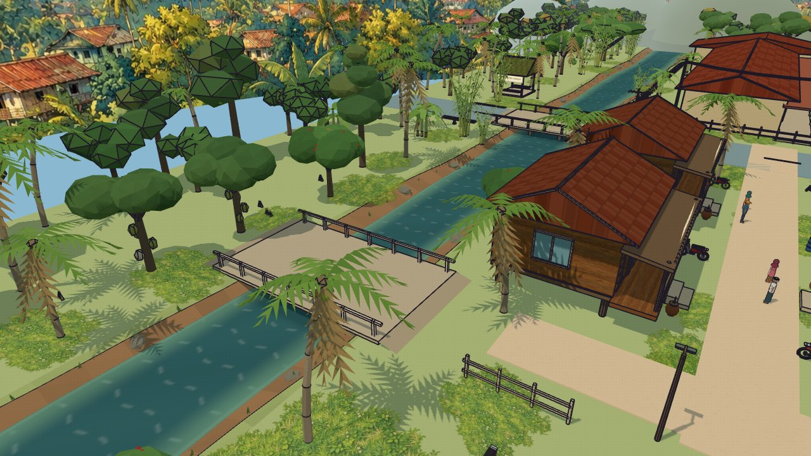
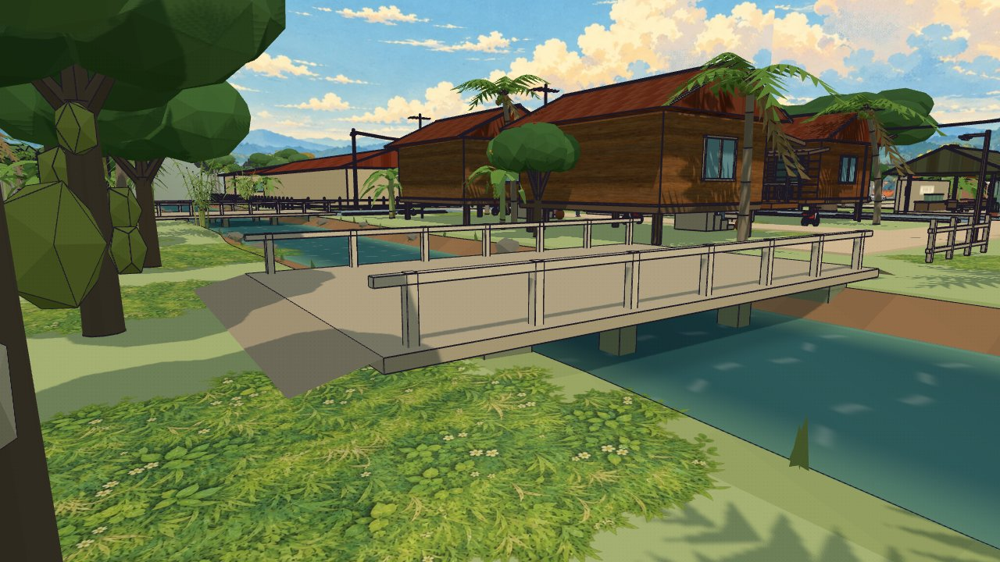
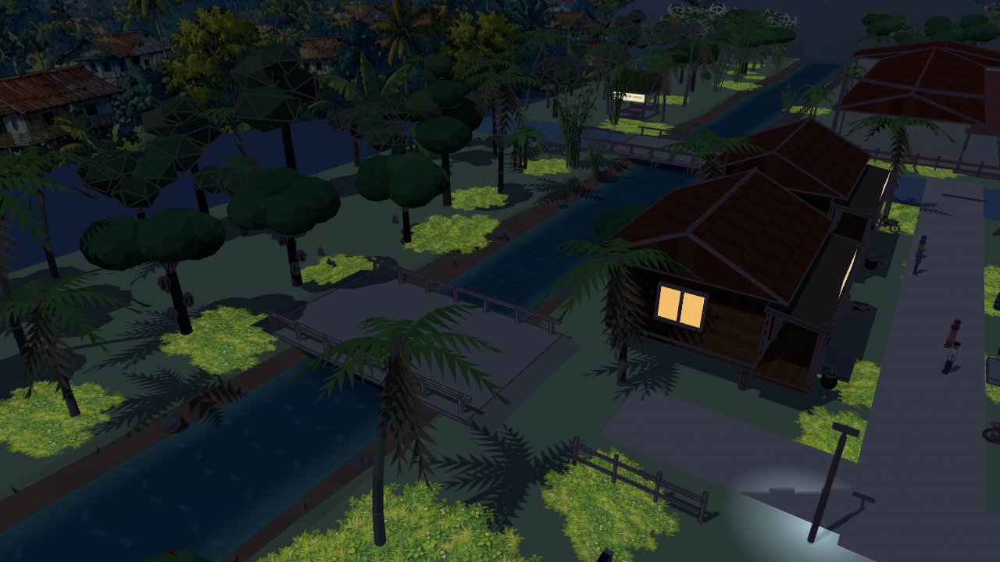
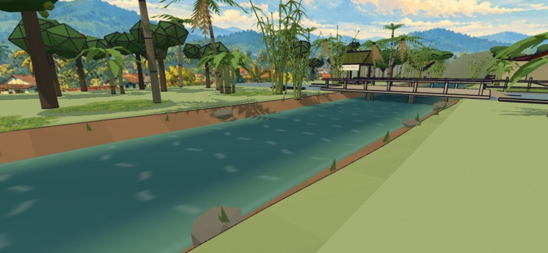

# River upgrade · v2.11.0

The former flat water box is replaced with a recessed channel. The original river corridor and both bridge locations remain in place. Water sits at −0.66 m, 61 cm below the grass surface; the bed reaches −1.4 m. Irregular faceted earth slopes, shallow edge colour and a darker centre establish depth. A slow shader current moves broken ripples without rebuilding geometry. Concrete abutments, piers and short ramps connect the bridge decks to the existing roads and grass. Thirty-one rocks, ninety small tufts and four reused bamboo clusters sit inside the blocked river corridor, away from crossing approaches.

The water uses the existing toon lighting, fog and day/night sky. It is opaque and uses no reflection render target. The animation updates one uniform per frame. Shared river dimensions drive terrain height and collision; the minimap footprint and routes remain unchanged.

## Actual scene captures

The before and after views use the same 1280 × 720 camera and afternoon light. These are browser renders of the game scene.

| Original v2.10.0 | River v2.11.0 |
|---|---|
|  |  |

## Validation

- `npm test`: 198 tests pass, including five river tests for terrain ordering, deck/ramp continuity, both crossings, bank collision, decoration placement and stable animation geometry. The existing route tests cover all 38 doors from both player starts.
- `npm run build`: passes. The cache version is v2.11.0 throughout the module graph.
- `RETRO_CHROMIUM=/path/to/chromium node scripts/check-river-browser.mjs`: passes. The real Three.js scene renders at desktop and phone landscape sizes, both bridge crossings are clear, raycasting finds the lower water surface, and fixed-camera pixel checks change when only water time changes. No runtime exceptions occurred.
- The actual scene with stationary NPC bodies yields 74 of 76 direct door routes. Both missing routes target house 14, Mei Ling, and the unchanged v2.10.0 baseline has exactly the same result. This fixture limitation is not a new river obstruction.
- At the identical afternoon overview camera, baseline render counters are 381 draw calls / 368,595 submitted triangles; the new scene uses 399 / 385,377. These include shadow passes. This is a headless renderer comparison, not a physical-phone FPS benchmark.

For interactive review, run `npm run dev` and open `/scripts/river-preview.html`. Switch between the overview, bridge and bank views, day/dusk/night, and moving water. This local reviewer page is excluded from the production build.

This change is prepared for review on a separate branch. It has not been merged or deployed.
