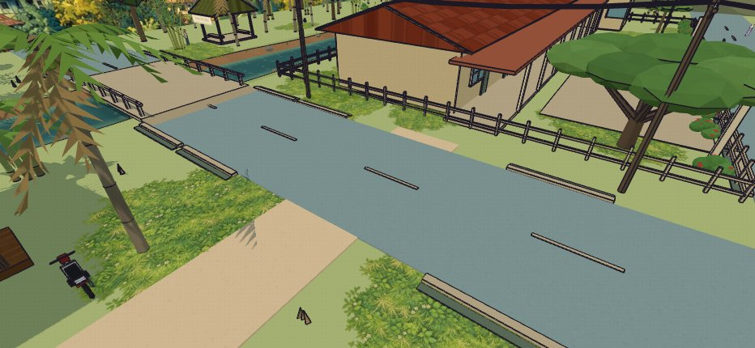
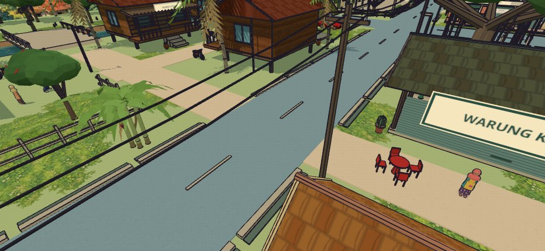

# Road overlap fix · v2.11.1

Road boxes used identical top heights (0.055 m). Five dirt/asphalt joins and two asphalt/asphalt junctions therefore had duplicate coplanar faces; several dirt/dirt intersections did too. The renderer could alternate between them as the camera moved.

`road-surfaces.js` partitions the road rectangles once during world construction. Asphalt takes precedence at mixed junctions. Later rectangles are trimmed around already covered areas, including same-kind intersections and the existing extensions to the landscape edge. The renderer keeps its world-aligned texture coordinates so the fragments do not introduce texture seams. The existing static material batching still applies.

Logical road positions, standing heights, collision, navigation, bridge geometry, road markings, kerbs and planting inputs remain the same. The release cache/version is v2.11.1; the latest character-face and petrol-station changes are retained.

## Validation

- All 202 Node tests pass, including four regression tests. The exact grid of all road/fragment boundaries checks complete coverage and asphalt priority at every cell, while pairwise checks reject overlapping fragments. Tests include enclosed duplicates, edge-touching roads, narrow half-metre joins and road extensions.
- Production build passes.
- Browser checks passed with no runtime exceptions. Reproduction: `RETRO_CHROMIUM=/path/to/chromium node scripts/check-roads-browser.mjs`. Raycasting checks one road top at ten real mixed and same-kind intersections; both bridge crossings remain clear. The script captures the kampung and market junctions at 932 × 430.

